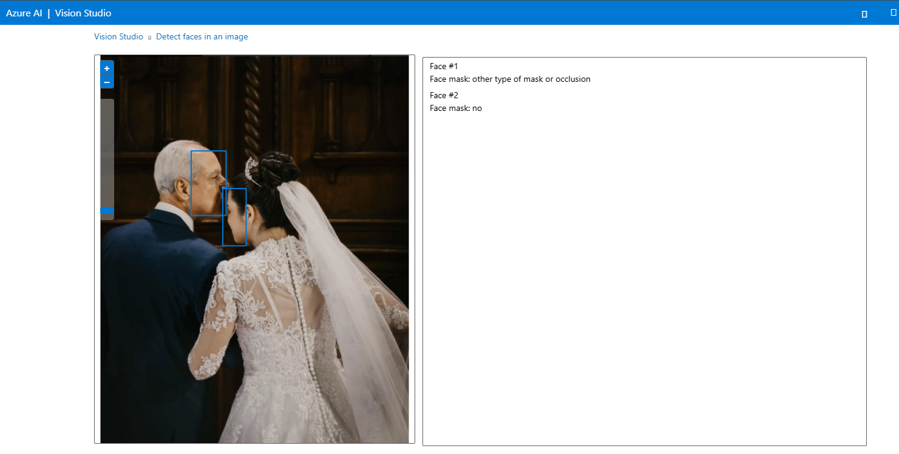
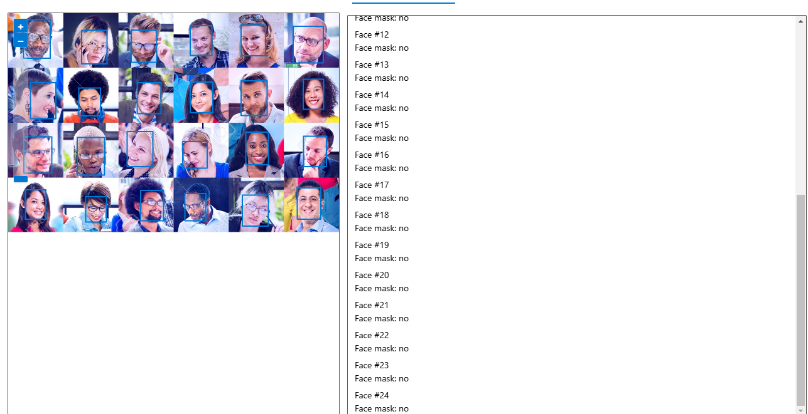
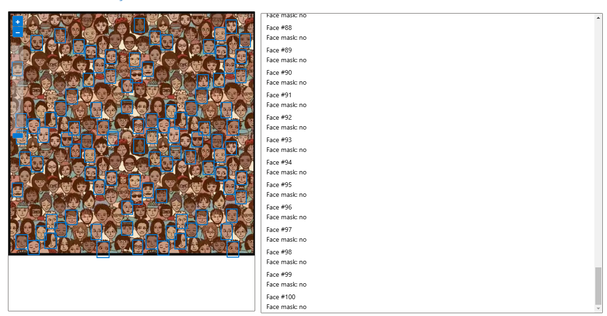
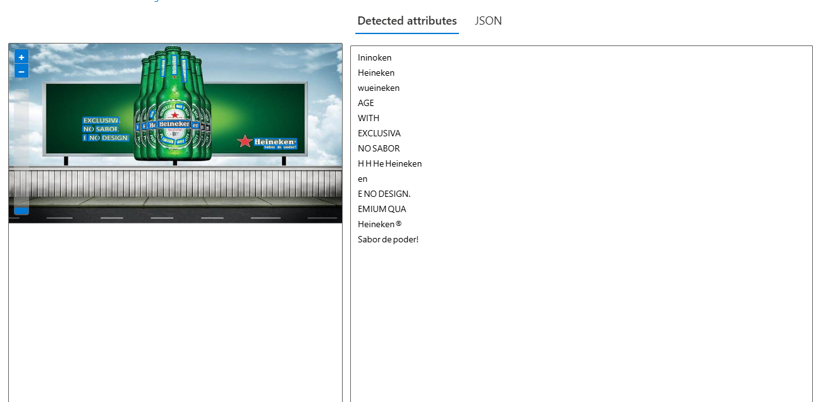

# DIO-visao-computacional

Projeto para desafio DIO, módulo Visão Computacional

## Processo, insights e possibilidades

### Processo Face

1. Cliquei no View all resources, para ver meus resources criados, selecionei o principal e defini como default.
2. Escolhi a opção de Face e marquei a box falando que vou usar a função Demo em minha resource.
3. após isso clico na opção de Browser for a file ou arrasta a imagem para o local selecionado, após esse passo, a IA mostra quantas faces ela reconheceu.
   

Observação: fiz um teste com muitas faces e ele nao reconheceu todas, porem se forem espaçadas ele reconhece: Exemplos

- Ele reconhece as 24 pessoas:

- Ele não reconhece todos os rostos:

### Processo Extract text from images

1. Cliquei no View all resources, para ver meus resources criados, selecionei o principal e defini como default.
2. Escolhi a opção de Optical character recognition e entre na Extract text from images.
3. após isso clico na opção de Browser for a file ou arrasta a imagem para o local selecionado, após esse passo, a IA os textos que estão na imagem.
   

### Insights e possibilidades

Fiquei muito impressionado com a função de contagem facial nas imagens, isso pode ser usado em estabelecimentos que desejam saber quantos clientes passaram por ele, em um determinado dia, pode ser conectado ao sistema de camera e a cada pessoa que entra, o sistema irá contabilizando e sobre o extract text, me impressionou que até as letras miúdas das garrafas a ferramenta conseguiu pegar.
